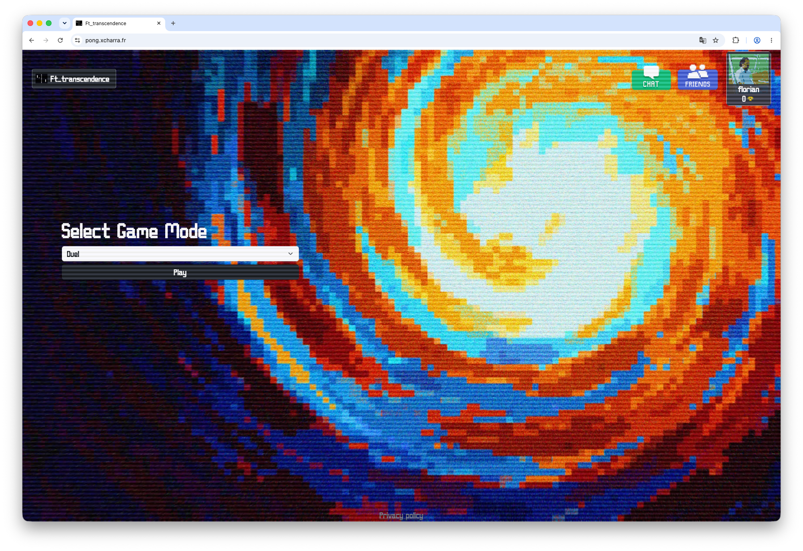
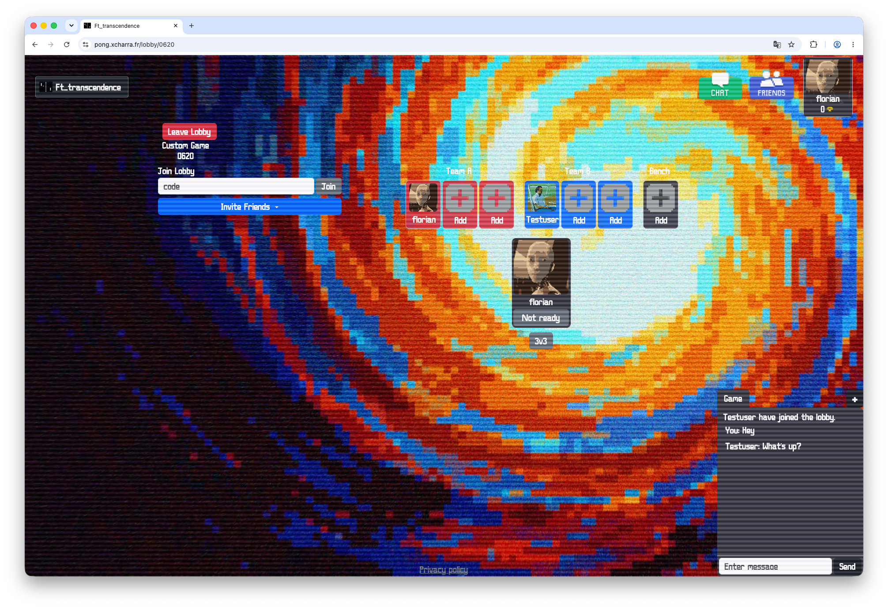
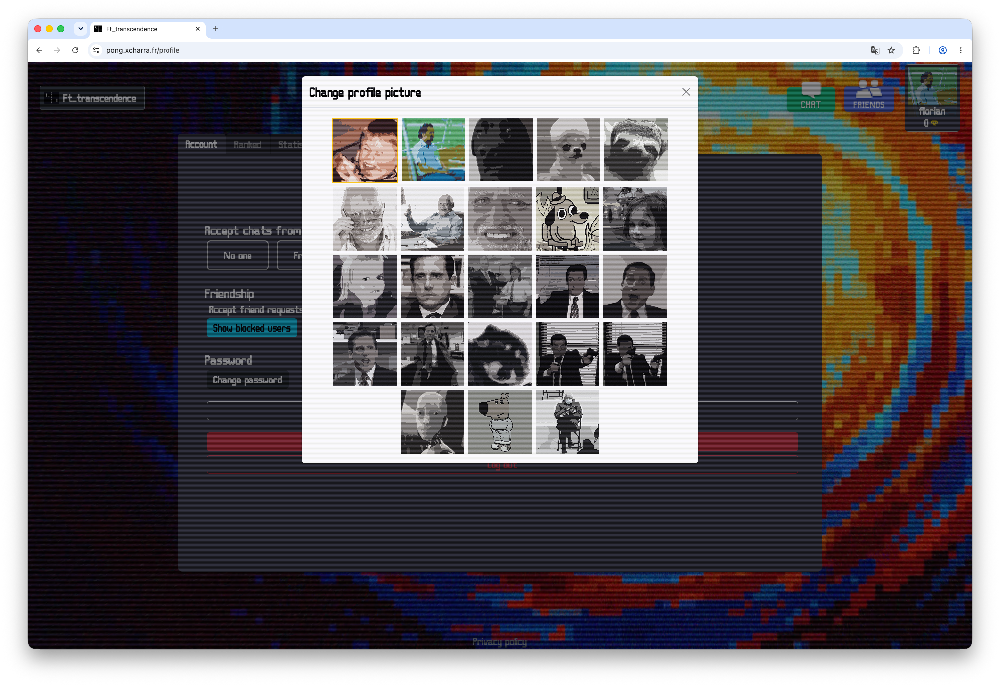
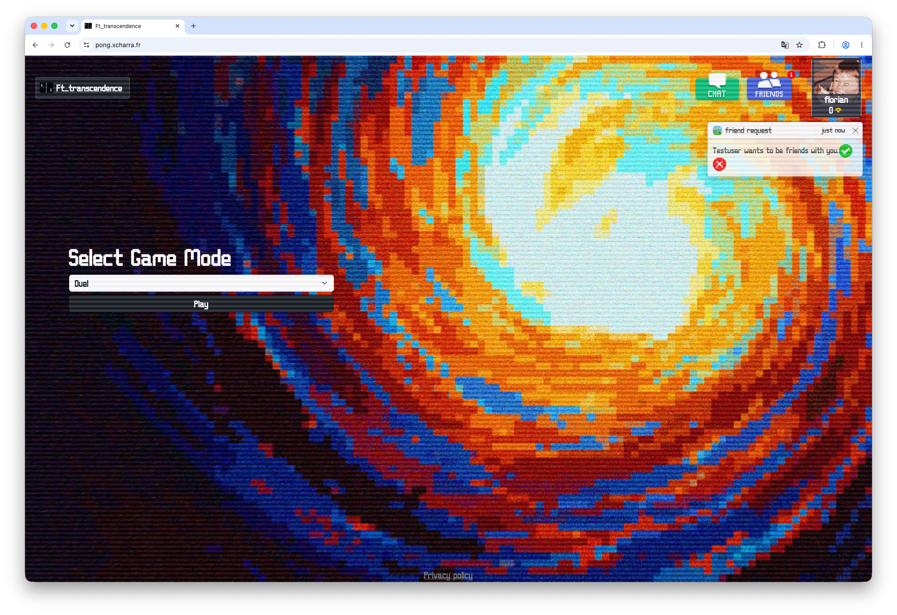
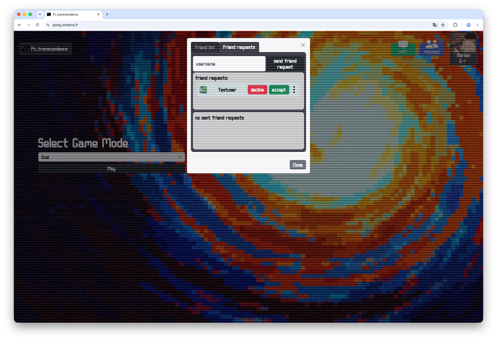

# ft_transcendence

A full-stack web-based implementation of the classic Pong game with modern features, real-time multiplayer gameplay, user authentication, tournaments, and comprehensive statistics.

<div>



[](LICENSE)
[](https://www.python.org/)
[](https://www.djangoproject.com/)
[](https://www.docker.com/)
[](#)

</div>

---

## 🎮 About

**ft_transcendence** is a comprehensive web application that transforms the classic Pong game into a modern, feature-rich multiplayer platform. Built with a full-stack architecture, it combines Django backend microservices with a responsive Bootstrap frontend to deliver real-time gaming experiences with user management, live chat, tournaments, and detailed analytics.

This project demonstrates mastery of:
- Full-stack web development
- Real-time application programming
- Microservices architecture
- User authentication and authorization
- Database design and management
- WebSocket communication
- GDPR compliance implementation

---

## ✨ Features

### Core Gameplay
- ⚽ **Classic Pong Game** - Server-side game logic with real-time synchronization
- 🎯 **Multiplayer Support** - Play with up to 6 players simultaneously (3 vs. 3)
- 👥 **Remote Players** - Challenge players across the network
- 🏆 **Tournament System** - Bracket-based tournament management with live tracking
- 👁️ **Spectator Mode** - Watch other players in real-time

### User Management
- 🔐 **Secure Authentication** - JWT-based user authentication
- 👤 **User Profiles** - Customizable profiles with profile pictures
- 📊 **Game Statistics** - Comprehensive dashboards with win/loss records, rankings
- 🎖️ **User Rankings** - Elo rating system and leaderboards
- 🚫 **User Blocking** - Block unwanted players from interactions
- 👫 **Friend System** - Add, manage, and interact with friends

### Social Features
- 💬 **Live Chat** - Real-time messaging between players
- 🔔 **Notifications** - Game invites, friend requests, and updates
- 🌐 **Direct Messaging** - Private communication with other users

### Data & Privacy
- 📈 **Advanced Analytics** - Game history, performance metrics, and trend analysis
- 🔒 **GDPR Compliance** - User data anonymization and account deletion options
- 💾 **Data Export** - Download user data in structured formats
- 🕐 **Audit Logs** - Track user activities and data access

### CLI Integration
- 🖥️ **Command-Line Interface** - Play Pong against web users via terminal
- 🔌 **API Integration** - Seamless CLI-to-web server communication

---

## 🏗️ Architecture

The application follows a **microservices architecture** with clear separation of concerns:

```
┌─────────────────────────────────────────────────────────────┐
│                    Frontend (Caddy Reverse Proxy)           │
├─────────────────────────────────────────────────────────────┤
│  Bootstrap UI │ WebSockets │ Real-time Updates │ Socket.IO  │
├─────────────────────────────────────────────────────────────┤
│                    Backend Services (Django)                 │
├──────────────┬──────────────┬──────────────┬────────────────┤
│   Auth       │   Game       │   Chat       │   Tournament   │
│   Service    │   Service    │   Service    │   Service      │
├──────────────┴──────────────┴──────────────┴────────────────┤
│  Redis (Cache & Session) │ PostgreSQL (Primary Database)    │
└─────────────────────────────────────────────────────────────┘
```

---

## 📦 Modules

### Major Modules (10 points each)
- ✅ **Framework Backend** - Django web framework for backend development
- ✅ **Microservices Architecture** - Distributed service design
- ✅ **User Management & Authentication** - Complete auth system with JWT
- ✅ **Remote Players** - Network-based multiplayer support
- ✅ **3v3 Multiplayer** - Extended gameplay with up to 6 simultaneous players
- ✅ **Live Chat System** - Real-time messaging infrastructure
- ✅ **Server-Side Pong & API** - Server-authoritative game logic with REST API
- ✅ **CLI Integration** - Command-line Pong player with web integration

### Minor Modules (5 points each)
- ✅ **Frontend Framework** - Bootstrap for responsive UI design
- ✅ **PostgreSQL Database** - Relational database management system
- ✅ **User & Game Stats Dashboards** - Comprehensive analytics and visualization
- ✅ **GDPR Compliance** - Data anonymization and deletion options
- ✅ **Browser Compatibility** - Cross-browser support (Chrome, Firefox, Safari, Edge)

### Bonus Features
- Additional advanced analytics
- Enhanced security features
- Extended game modes

---

## 🛠️ Tech Stack

### Backend
| Technology | Version | Purpose |
|-----------|---------|---------|
| **Python** | 3.11+ | Backend programming language |
| **Django** | 4.0+ | Web framework |
| **PostgreSQL** | Latest | Primary database |
| **Redis** | Latest | Caching & session management |
| **Socket.IO** | Latest | Real-time bidirectional communication |

### Frontend
| Technology | Purpose |
|-----------|---------|
| **HTML5/CSS3** | Markup & styling |
| **JavaScript (Vanilla)** | Frontend logic |
| **Bootstrap 5** | Responsive UI components |
| **Chart.js** | Data visualization |

### DevOps & Infrastructure
| Technology | Purpose |
|-----------|---------|
| **Docker** | Containerization |
| **Docker Compose** | Multi-container orchestration |
| **Caddy** | Web server & reverse proxy |
| **SSL/TLS** | Secure communication |

### Development Tools
| Tool | Purpose |
|------|---------|
| **Make** | Build automation |
| **Git** | Version control |
| **Textual** | CLI framework |

---

## 🚀 Installation & Setup

### 1. Clone the Repository

```bash
git clone https://github.com/yourusername/ft_transcendence.git
cd ft_transcendence
```

### 2. Generate Secrets and SSL Certificates

The Makefile automatically handles this:

```bash
make secrets
```

This will:
- Generate secure passwords and encryption keys
- Create SSL/TLS certificates for HTTPS

### 3. Build and Run with Docker

```bash
# Build and start all services
make

# Or start in detached mode (background)
make detach
```

The application will be available at:
- **Web Application**: https://localhost


---

## 💻 Usage

### Web Application

1. **Access the Application**
   - Navigate to `https://localhost` in your browser
   - Accept the self-signed SSL certificate

2. **Create an Account**
   - Register with username, email, and password
   - Verify your email address

3. **Play the Game**
   - Access the lobby to find or create a game room
   - Challenge other players or join existing games
   - Participate in tournaments

4. **Social Features**
   - Add friends from the player directory
   - Join the live chat
   - Receive and respond to notifications

5. **View Statistics**
   - Check your profile and game history
   - View leaderboards and rankings
   - Analyze your performance metrics

### Management Commands

```bash
# Interactive shell in a service
make exec SERVICE=backend

# View specific service logs
make logs SERVICE=backend

# Restart services
make restart SERVICE=frontend

# Stop all services
make down

# Complete cleanup
make fclean
```

### CLI Pong Player

```bash
# Navigate to CLI directory
cd srcs/requirements/pong-cli

# Install dependencies
pip install -r requirements.txt

# Run the CLI game
python main.py

# Connect to a web user
python main.py --server https://localhost --player username
```

---

## 📁 Project Structure

```
ft_transcendence/
├── srcs/                           # Source code
│   ├── requirements/
│   │   ├── backend/                # Django backend services
│   │   │   ├── app/                # Main Django app
│   │   │   ├── game/               # Game logic service
│   │   │   ├── auth/               # Authentication service
│   │   │   ├── chat/               # Chat service
│   │   │   └── tournament/         # Tournament service
│   │   ├── frontend/               # Web frontend
│   │   │   ├── templates/          # HTML templates
│   │   │   ├── static/             # CSS, JS, Bootstrap
│   │   │   └── views/              # Django views
│   │   └── pong-cli/               # CLI Pong player
│   ├── docker-compose-prod.yml     # Production Docker setup
│   └── .env                        # Environment variables
├── .img/                           # Screenshots & images
├── launch.d/                       # Startup scripts
├── Makefile                        # Build automation
├── README.md                       # This file
├── API-Documentation-en.md         # English API docs
├── API-Documentation-fr.md         # French API docs
└── LICENSE                         # MIT License
```

---

## 📚 API Documentation

Complete API documentation is available in the project:

- [English API Documentation](./API-Documentation-en.md)

### Key Endpoints

| Method | Endpoint | Description |
|--------|----------|-------------|
| `POST` | `/api/auth/register` | User registration |
| `POST` | `/api/auth/login` | User login |
| `GET` | `/api/users/<id>` | Get user profile |
| `POST` | `/api/games/create` | Create game room |
| `GET` | `/api/games/` | List active games |
| `WS` | `/ws/game/<room_id>` | WebSocket game connection |
| `WS` | `/ws/chat/<room_id>` | WebSocket chat connection |
| `GET` | `/api/tournaments/` | List tournaments |
| `POST` | `/api/tournaments/create` | Create tournament |

For detailed endpoint documentation, see the API documentation files.

---

## 🎬 Screenshots

### Home Page


### Custom Lobby


### Profile Management


### Notifications


### Friend System


---

## 👥 Team

This project was developed by:

- **bajeanno**
- **fguirama**
- **jcoquard**
- **nfaust**
- **xcharra**

---

## 📖 Additional Resources

- [Django Documentation](https://docs.djangoproject.com/)
- [PostgreSQL Documentation](https://www.postgresql.org/docs/)
- [Docker Documentation](https://docs.docker.com/)
- [Socket.IO Documentation](https://socket.io/docs/)
- [Bootstrap Documentation](https://getbootstrap.com/docs/)
